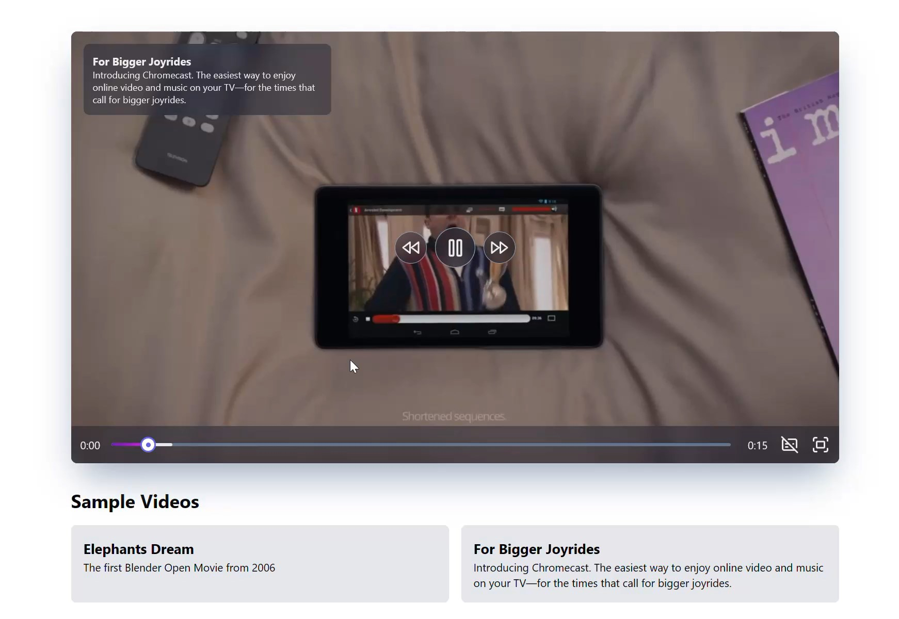

# Video Streaming Example

This is a sample video player application that demonstrates how to play video streams using Node.js and Express. The application includes a custom video player with various features.

## Features

- Simple Node.js, Express video streaming
- Supports browser `Content-Range` header for video streaming
- Video preview thumbnails on Seek bar (using a single video contact sheet to avoid multiple requests to the server)
- Video buffering indicator
- Video player with custom controls:
  - Play/Pause
  - Volume control
  - Fullscreen
  - Seek bar
  - Preview Thumbnails
  - Closed Captions
  - Keyboard shortcuts

## How to Run

1. Clone the repository.
2. Install dependencies using `pnpm install`.
3. Start the server and client:
   - Navigate to the `server` directory and run `pnpm start`.
   - Navigate to the `client` directory and run `pnpm dev`.
4. Open the application in your browser at `http://localhost:5173`.

## Sample Videos

The application includes the following sample videos:

1. **Elephants Dream**  
   Description: The first Blender Open Movie from 2006.

2. **For Bigger Joyrides**  
   Description: Introducing Chromecast. The easiest way to enjoy online video and music on your TV—for the times that call for bigger joyrides.

## License

This project is licensed under the MIT License.

## Author

[GitHub: @miadv](https://github.com/miadv)
